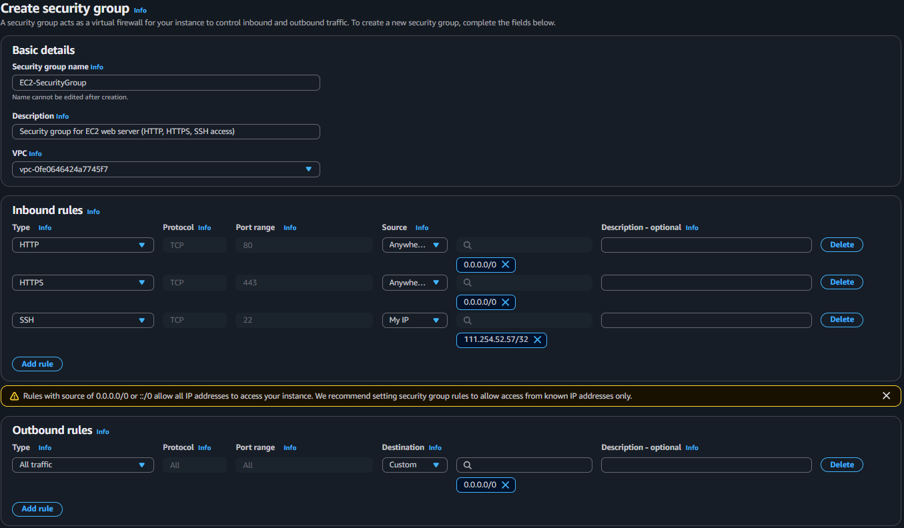
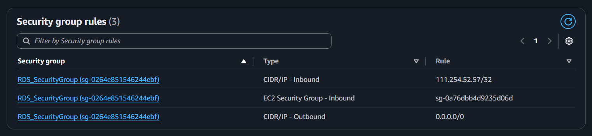
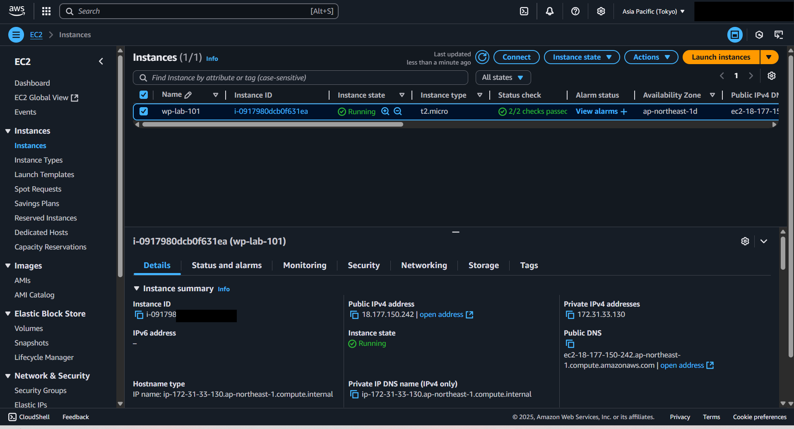
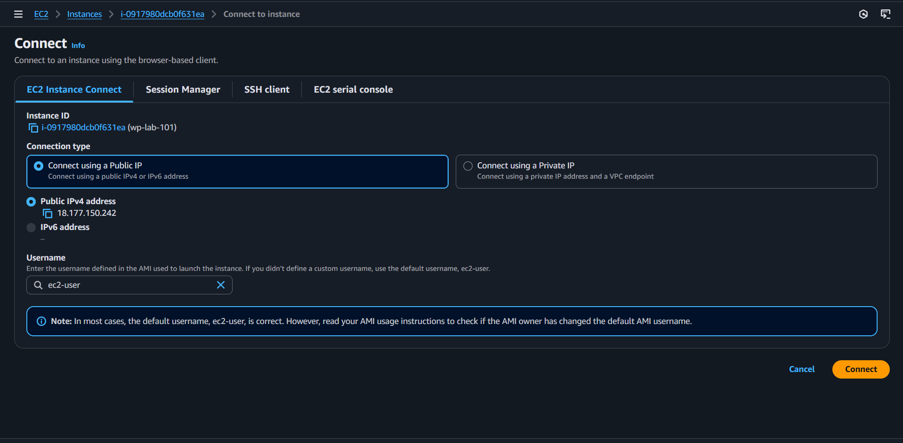
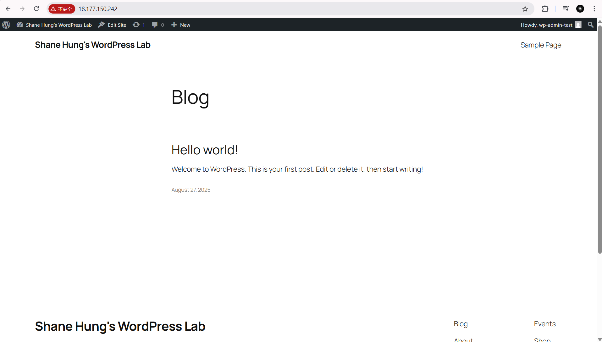
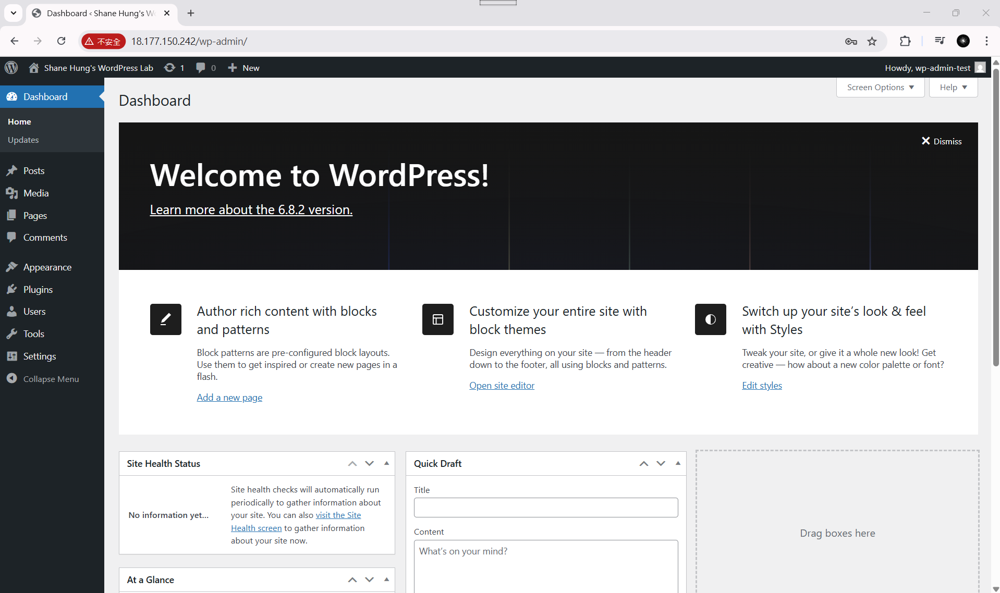

# WordPress Deployment on AWS (EC2 + RDS)

## 📖 Introduction
Deploying WordPress on AWS can be achieved with a straightforward setup that balances practicality and clarity.  
In this walkthrough, I demonstrate how to run a WordPress site using **Amazon EC2** as the web server host and **Amazon RDS** as the managed database service.

This streamlined approach avoids extra components like load balancers or domain routing services, focusing instead on the essential foundation:

- An EC2 instance configured with Apache/PHP to serve WordPress  
- An RDS instance for secure and reliable database storage  

The goal is to provide clear, screenshot-based evidence of the end-to-end process — from provisioning resources to accessing the WordPress dashboard — while keeping the architecture lean and easy to understand.

---

## 🏗️ Architecture at a Glance
- Users access WordPress directly through the **EC2 instance’s public IP address**.  
- The EC2 server connects to the **RDS instance** over port 3306, restricted by Security Groups to allow only application-to-database communication.  
- This setup ensures a working WordPress deployment with basic security boundaries and cost efficiency, ideal as a first step before adding scaling components later.  

---

## ☑️ Steps

### Step 1. Create EC2 for WordPress
Launch an EC2 instance (Amazon Linux 2).  
Select key pair, instance type, and security group.  

  


---

### Step 2. Connect to EC2 Instance (Instance Connect)
Use AWS Console → **EC2 Instance Connect** to open a browser-based shell.  

  


---

### Step 3. Connect to EC2 via SSH (Local Terminal)
From your local terminal, connect with the PEM key:

```bash
ssh -i ~/Downloads/wp-lab-101-key.pem ec2-user@<EC2-Public-IP> 
```  
Step 4. Install Apache on Amazon Linux 2
bash
Copy code
sudo yum update -y
sudo yum install -y httpd
sudo systemctl start httpd
sudo systemctl enable httpd

Step 5. Install PHP & MariaDB on Amazon Linux 2
bash
Copy code
sudo amazon-linux-extras enable php8.0
sudo yum install -y php php-mysqlnd mariadb105

Step 6. Download and Configure WordPress
bash
Copy code
wget https://wordpress.org/latest.tar.gz
tar -xzf latest.tar.gz
sudo cp -r wordpress/* /var/www/html/
sudo usermod -a -G apache ec2-user

Step 7. Create RDS Instance for WordPress
Choose MySQL engine, configure instance class, storage, connectivity, and security groups.


Step 8. Connect EC2 and RDS
Update wp-config.php in /var/www/html/ with your RDS info:

php
Copy code
define( 'DB_NAME', 'wp_database' );
define( 'DB_USER', 'admin' );
define( 'DB_PASSWORD', 'yourpassword' );
define( 'DB_HOST', '<RDS-endpoint>' );

### Step 9. WordPress Installation (Success)
Open the EC2 public IP in a browser and complete the WordPress installer.

**Frontend (Hello world!)**  


**Admin Dashboard**  


✅ Result

WordPress website is accessible via EC2 Public IP

RDS provides a separate managed database layer

Security Groups restrict database access only to EC2 and trusted IPs

This marks the completion of a minimal, cost-efficient WordPress deployment on AWS.


---

⚠️ **Warning**  
This is not a complete guide — It is a personal showcase.  

✅ Final Check — Please remember to delete all AWS resources after use to avoid unexpected costs:  
- EC2 Instances  
- EBS Volumes  
- RDS Instances  
- Security Groups  
- Custom AMIs & Snapshots  
- Key Pairs (if not reused)  

Always double-check your AWS Console (EC2, RDS, VPC, IAM) before leaving resources running.
